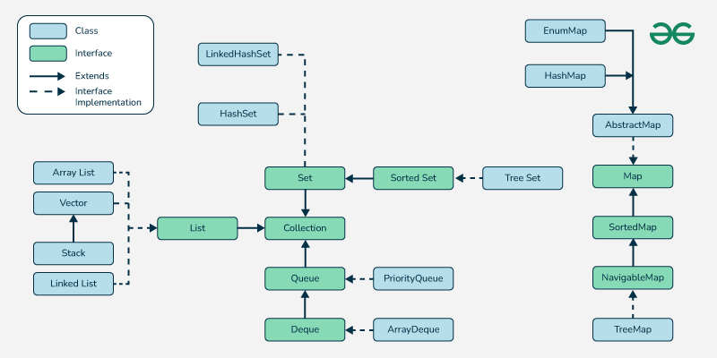

Java provides various classes and interfaces for working with groups of objects. The java.util package is where most of the collection-related classes reside. There are several types of collections, but I'll break it down into some of the key components.



### 1\. **Collection Interface**

The root of the collection hierarchy is the Collection interface. It is the base interface for all collections, but you won't typically use Collection directly. Instead, you'll use more specialized interfaces that extend Collection.

### 2\. **Common Collection Interfaces**

*   **List (Ordered, Allows Duplicates)**: An ordered collection that can contain duplicate elements. Elements in a list can be accessed by their index (position in the list).
    
    *   Example classes: ArrayList, LinkedList, Vector
        
    *   Common methods:
        
        *   add(E element)
            
        *   get(int index)
            
        *   remove(int index)
            
        *   size()
            
*   **Set  (Unique Elements, Unordered)**: A collection that doesn't allow duplicates. It is unordered, meaning elements do not have a specific position.
    
    *   Example classes: HashSet, LinkedHashSet, TreeSet
        
    *   Common methods:
        
        *   add(E element)
            
        *   remove(Object element)
            
        *   contains(Object element)
            
        *   size()
            
*   **Queue**: A collection designed for holding elements prior to processing. A queue typically follows FIFO (First In, First Out) ordering.
    
    *   Example classes: LinkedList, PriorityQueue
        
    *   Common methods:
        
        *   add(E element)
            
        *   poll()
            
        *   peek()
            
        *   remove()
            
*   **Deque**: A "double-ended queue" that allows elements to be added or removed from both ends.
    
    *   Example classes: ArrayDeque, LinkedList
        
    *   Common methods:
        
        *   addFirst(E element)
            
        *   addLast(E element)
            
        *   removeFirst()
            
        *   removeLast()
            
*   **Map  (Key-Value Pairs, Unique Keys)**: A collection that maps keys to values. It doesn't extend the Collection interface, but it is part of the collections framework.
    
    *   Example classes: HashMap, TreeMap, LinkedHashMap
        
    *   Common methods:
        
        *   put(K key, V value)
            
        *   get(Object key)
            
        *   remove(Object key)
            
        *   keySet()
            

### 3\. **Collection Classes**

*   **ArrayList**: A list implementation backed by an array, with dynamic resizing.
    
    *   Example: ArrayList list = new ArrayList<>();
        
    *   ArrayList offers fast random access but slower insertions and deletions (except at the end).
        
*   **LinkedList**: A doubly-linked list implementation of the List and Deque interfaces. It allows fast insertions and deletions, especially at the beginning or end.
    
    *   Example: LinkedList list = new LinkedList<>();
        
    *   It is slower for accessing elements by index compared to ArrayList.
        
*   **HashSet**: A set implementation backed by a hash table. It doesn’t maintain any order of elements and doesn't allow duplicates.
    
    *   Example: HashSet set = new HashSet<>();
        
*   **TreeSet**: A set that maintains elements in sorted order (natural order or by a specified comparator).
    
    *   Example: TreeSet set = new TreeSet<>();
        
*   **HashMap**: A map implementation that stores key-value pairs in a hash table. It allows fast access to values by key.
    
    *   Example: HashMap map = new HashMap<>();
        
*   **TreeMap**: A map that maintains keys in sorted order (natural order or by a specified comparator).
    
    *   Example: TreeMap map = new TreeMap<>();
        

### 4\. **Iterators**

Most collections in Java provide an iterator to loop over the elements.

*   **Iterator**: Allows for traversing through the collection.
    
    *   javaCopyIterator iterator = list.iterator();while (iterator.hasNext()) { System.out.println(iterator.next());}
        

### 5\. **Common Methods for All Collections**

Here are some general methods available to many collection types:

*   add(E element): Adds an element to the collection.
    
*   remove(Object o): Removes a specific element from the collection.
    
*   contains(Object o): Checks if an element exists in the collection.
    
*   size(): Returns the number of elements in the collection.
    
*   clear(): Removes all elements from the collection.
    
*   isEmpty(): Checks if the collection is empty.
    

### Example Usage:

```
import java.util.*;

public class CollectionExample {
  public static void main(String[] args) {
    
    // List Example (ArrayList)
    List list = new ArrayList<>();
    list.add("Apple");
    list.add("Banana");
    list.add("Cherry");
    System.out.println("List: " + list);

    // Set Example (HashSet)
    Set set = new HashSet<>();
    set.add("Apple");
    set.add("Banana");
    set.add("Apple");

    // Duplicate will not be added
    System.out.println("Set: " + set);

    // Map Example (HashMap)
    Map map = new HashMap<>();
    map.put("Alice", 25);
    map.put("Bob", 30);
    System.out.println("Map: " + map);

    // Queue Example (LinkedList)
    Queue queue = new LinkedList<>();
    queue.add("First");
    queue.add("Second");
    queue.add("Third");
    System.out.println("Queue: " + queue);
    System.out.println("Poll from Queue: " + queue.poll());
    System.out.println("Queue after poll: " + queue);
  }
}  
```

### Summary

*   **Lists** are ordered and can have duplicates.
    
*   **Sets** are unordered and cannot have duplicates.
    
*   **Queues** are used for FIFO ordering.
    
*   **Maps** store key-value pairs.
    
*   Use iterators to traverse through collections.
    
